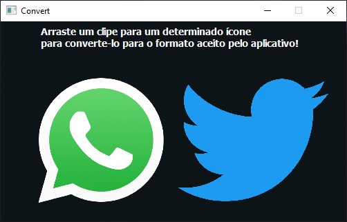

# ffmpeg converter

**Um pequeno aplicativo para converter clipes(.mp4) para determinadas plataformas.**



## Obtendo
Obtenha o zip do último [release](https://github.com/joao678/nodegui-ffmpeg-convert/releases)

## Usando

Clone o repositório com o  [Git](https://git-scm.com) e rode com [Node.js](https://nodejs.org/en/download/)

Abra um prompt de comando e digite:

```bash
# Clona o repositório
git clone https://github.com/joao678/nodegui-ffmpeg-convert
# Vá dentro do repositório
cd nodegui-starter
# Instale as dependências com o NPM
npm install
# Rode o aplicativo
npm start
```

## Distribuindo o aplicativo como executável

Para distribuir é só usar o [@nodegui/packer](https://github.com/nodegui/packer)

### Passo 1: (_**Rode esse comando apenas uma vez**_)

```sh
npx nodegui-packer --init FFmpegConvert
```

Esse comando gera as pastas necessárias onde será colocado o build

### Passo 2: (_**Rode esse comando quando quiser gerar um novo executável**_)

Para gerar os arquivos:

```sh
npm run build
```

Esse comando irá produzir um pacote dentro da pasta `./dist`

```sh
npx nodegui-packer --pack ./dist
```

Esse comando irá gerar o executável dentro da pasta `./deploy/win32/build`, após isso é só rodar o `qode.exe`

Mais detalhes sobre o empacotador podem ser encontrados aqui: https://github.com/nodegui/packer

## License

MIT
